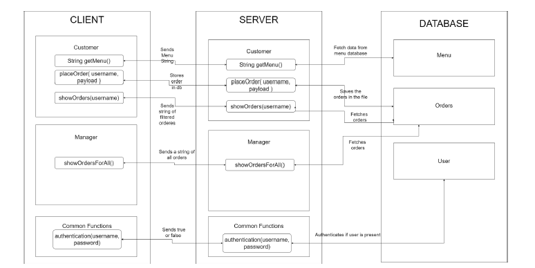
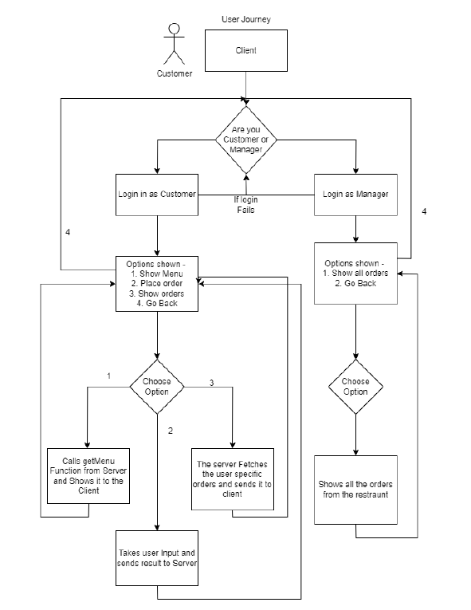
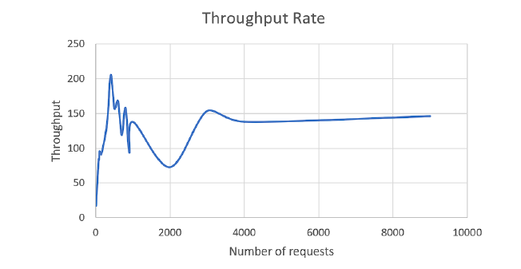
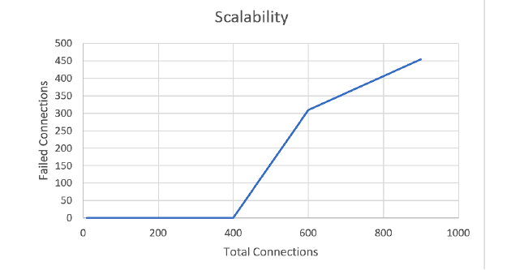

# Restaurant Management Command Line App using CORBA

## Project Overview

Welcome to the Restaurant Management Command Line App using CORBA! This project, developed by Peeyush Gupta, showcases a robust and efficient restaurant management application that utilizes the power of the Common Object Request Broker Architecture (CORBA). Designed to serve both customers and managers, the app streamlines the ordering process, enhances user experience, and provides valuable insights into system performance.

## System Design

## User Journey

## Key Features

- **Authentication:** Ensure secure access with username and case-sensitive password validation.
- **Menu Retrieval:** Retrieve the complete restaurant menu with item names and prices.
- **Order Placement:** Seamlessly place orders with intuitive commands and real-time updates.
- **Order Tracking:** Allow customers and managers to track order status and history.
- **Scalability Testing:** Evaluate system performance and scalability under various loads.
- **Error Handling:** Monitor and report errors, enhancing overall reliability.

## Components

- **Server:** Efficiently processes requests and manages data transactions.
- **Client Interface:** Intuitive command-line interface for customers and managers.
- **Database:** Stores crucial data such as orders and menu information.

## Performance Metrics

- **Response Time:** Measure system responsiveness for different functions.
- **Throughput Rate:** Gauge the system's capacity to handle multiple requests concurrently.
  
- **Scalability:** Evaluate performance under increasing client loads using multithreading.
  
- **Error Occurrence:** Track and quantify errors and exceptions during system operations.

For more information, please check out CPRE-550 Project.pdf document.
